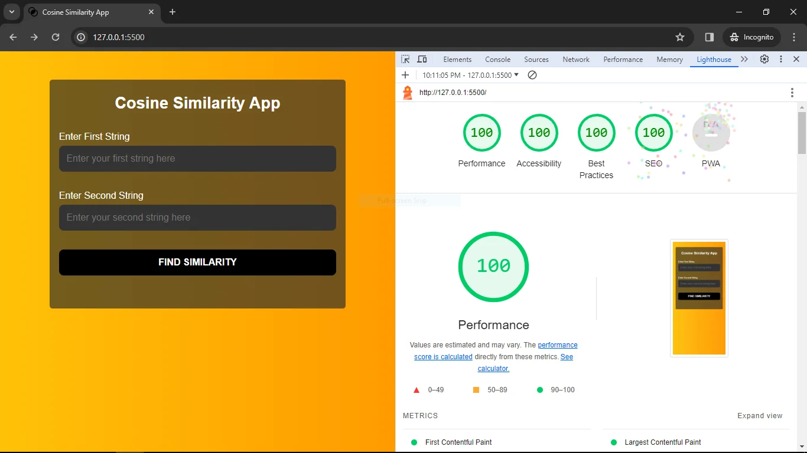

# Cosine Similarity Method 🌟

Welcome to the Cosine Similarity application! 🎉 This project allows you to calculate the Normalized Discounted Cumulative Gain (NDCG) for a set of ranked retrieval links, turning your information retrieval performance evaluation into a breeze! ⚡️

## Understanding Cosine Similarity: The Magic Behind Finding Similarities 📜

Imagine you're on a quest for knowledge online. The ideal search engine would prioritize the most relevant results at the top, wouldn't it? Cosine similarity comes to the rescue! This technique measures how "similar" two documents (or queries) are based on shared terms 💡

Think of it like comparing recipes ‍. Two recipes with many common ingredients (keywords) are likely to be similar, while recipes with few shared ingredients are probably different ✨

**Why is Cosine Similarity Important? **

Accuracy: It helps identify documents that are most relevant to your search query.
Efficiency: It's a computationally efficient way to compare documents, which means it runs quickly!
Flexibility: It can be combined with other techniques for further refinement.⚡️

**Live Demo:** https://similarity-algorithm.vercel.app/

## How Does This App Work? ️

- Enter Strings: Provide two sets of strings using the text areas (one per set). These could represent queries and documents, product descriptions, or any other information you want to compare.

- Union Formation: The app calculates the union of the two string sets, creating a comprehensive list of unique terms.

- Cosine Similarity: This widely used technique measures how similar each string in the original sets is to all other strings based on shared terms

- Show results in rate form

## Technologies Used 🛠️

This project is built using the following technologies:

- 📋 HTML
- 🎨 CSS
- 🌐 TypeScript: A statically-typed superset of JavaScript.

## Demo 🌐

Check out the live demo of the NDCG Calculator [here](https://similarity-algorithm.vercel.app/). Experience the power and simplicity of this tool firsthand!

## Usage 🚀

1. 🧪 Clone the repository: `git clone https://github.com/your-username/similarity-algorithm.git`
2. 📂 Navigate to the project directory: `cd similarity-algorithm`
3. 📦 Install tsc compiler: `npm install -g typescript`
4. ▶️ Start compiling TS code to js: `tsc -w`

## Contributing 🤝

Contributions are welcome! If you have any suggestions, bug reports, or feature requests, please open an issue or submit a pull request. We appreciate your input as we strive to make the NDCG Calculator even better! 🙌
